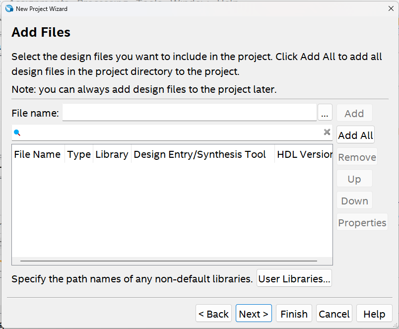

# 1章 実習ボード、開発ツールの使い方

## 1.1 使用する実習ボード

本実習では Intel社(ALTERA社)のFPGAチップCyclone Vが搭載された
DE0-CV開発ボードを使います。
このボードは、スライドスイッチ(SW9-0)、プッシュスイッチ(KEY0-4)、
LED(LEDR9-0)、7セグメントLED(HEX5-0)、GPIOなど多くのI/Oを
備えています。


[http://cd-de0-cv.terasic.com](http://cd-de0-cv.terasic.com)
より、ユーザーマニュアルをダウンロードしておいてください。

## 1.2 開発ツールについて

本実習では回路設計を行うための EDA(electronic design automation) ツールとして Quartus Prime Lite Edition を利用します。

[インテル Quartus Prime](https://www.altera.co.jp/products/design-software/fpga-design/quartus-prime/download.html)


## 1.3 実習ボード・開発ツールの使い方

実習ボードのスライドスイッチSW7-0に入力された0/1のビットパターンを
そのままLEDのLEDR7-0に表示する回路の設計実装を行う実習を通して、
実習ボードと開発ツールの使い方を学んでいきましょう。

それでは、Quartus Prime Lite Editionを起動し、実習用のプロジェクトを作成します。

### 1.3.1 プロジェクトの作成

ウィンドウ左上の [File] > [New Project Wizard] より、プロジェクト作成のためのウィザードを起動します。
起動すると、プロジェクト作成の設定項目が示された Introduction の画面が開きます。


[Next] を押して Project name and directory の設定にうつります。

---
#### Project name and directory 


ここでは以下の３項目をします。
- working directory (プロジェクトフォルダ)
- project (プロジェクト名)
- top-level entity (PFGAチップのPINを接続する一番外側の回路モジュール名)

working directory はプロジェクト用にフォルダを作成し、そのフォルダを選択します。
(パスには日本語やスペースを含まないようにすることをお勧めします)

設定例を示します。
- working directory: Z:/digital/working_directory/simple_io
- project: simple_io
- top-level entity: simple_io


#### Project Type


ここでは Empty project を選択してください。
設定を行ったら [Next] を押します。

#### Add Files



既に作成したデザインファイル(HDLのソースコード)やライブラリを
プロジェクトに取り込みたい場合に設定します。

今回はゼロから作成しますので、ファイルの追加は行いません。
設定を行ったら [Next] を押します。

#### Family, Device & Board Settings


開発対象のデバイス(FPGAチップ)を選択します。
実習ボード DE0-CV に搭載されている FPGA チップ Cyclone V 5CEBA4F23C7 を設定します。

右側の Name filter に 5CEBA4F23C7 と入力し、
下側の Available deices に表示される 5CEBA4F23C7 を選択しましょう。
設定を行ったら [Next] を押します。

#### EDA Tool Settings


シミュレータなど他のEDAツールを使う場合の設定です。
今回はそのままで次に進んでください。
設定を行ったら [Next] を押します。

#### Summary


これまでの設定を確認します。
設定になければ[Finish]を押してください。
プロジェクトのひな型が作成されます。

### 1.3.2 デザインファイルの作成

それでは、System Verilog で回路モジュールを記述し、
そのファイルをプロジェクトに追加します。

左上の [File] > [New] を選択すると、
新しいファイルを選択するためのウィザード New が開きます。
ウィザードに表示された一覧から Design Files 下の
System Verilog HDL File を選択し、 [OK] を押します。

中央のペインにテキストエディタが立ち上がります。
以下に示すデザインファイルを作成し、適切なファイル名を付けてプロジェクトフォルダの下に保存します。

```sv: simple_io.sv
module simple_io(
  input   logic [7:0] sw,
  output  logic [7:0] led
);

  assign led = sw;

endmodule
```

ファイルの保存は [File] > [save] を選択すると行えます。
なお、ファイル名の拡張子 System Verilog を示す .sv とする必要があります。(例 simple_io.sv)


### 1.3.3 プロジェクトのビルド

デザインファイルを追加したプロジェクトをビルドします。
以下の手順でビルドを行います。
- デザインファイルの解析
- FPGAのピンの割り当て
- プロジェクトのコンパイル

#### デザインファイルの解析

[Processing] > [Start] > [Start Analysis & Elaboration]
を選択し、デザインファイルの解析を行います。
数分程度時間がかかります。

下記の様に表示されれば大丈夫です。

```
Info: Quartus Prime Analysis & Elaboration was successful.
```

なお、デザインファイルに誤りがあると下記の様なエラー表示がでます。
修正を行ったうえで再度[Start Analysis & Elaboration]を行ってください。

```
Error (10161): Verilog HDL error at simple_io.sv(8): ...
```

#### FPGA のピンの設定


[Assignments] > [Pin Planner]を選択してPin Planner を起動します。
ここでは、設計した回路の入出力信号を FPGA のどのピンに割り当てるかを設定します。

今回は、simple_ioモジュールの出力信号 led[7]-led[0] をボードの LED デバイス LEDR7-LEDR0 に、
入力信号 sw[7]-sw[0] をスライドスイッチ SW7-sw0 に接続されるように、
表1.1のとおりピンの設定を行います。 

表の Location はFPGAチップのピンを表します。

[表1.1 : simple_ioモジュールのピン割り当て]

|Node Name|Location|割り当てデバイス|入出力|
|:---|:---|---|---|
|led[0]|PIN_AA2| LEDR0 | output |
|led[1]|PIN_AA1| LEDR1 | output |
|led[2]|PIN_W2| LEDR2 | output |
|led[3]|PIN_Y3| LEDR3 | output |
|led[4]|PIN_N2| LEDR4 | output |
|led[5]|PIN_N1| LEDR5 | output |
|led[6]|PIN_U2| LEDR6 | output |
|led[7]|PIN_U1| LEDR7 | output |
|sw[0]|PIN_U13| SW0 | input |
|sw[1]|PIN_V13| SW1 | input |
|sw[2]|PIN_T13| SW2 | input |
|sw[3]|PIN_T12| SW3 | input |
|sw[4]|PIN_AA15| SW4 | input |
|sw[5]|PIN_AB15| SW5 | input |
|sw[6]|PIN_AA14| SW6 | input |
|sw[7]|PIN_AA13| SW7 | input |

pin planner の Location の欄に Node Name に対応する PIN 番号を設定してください。
(なお、Locationの欄に AA2 と入力すると PIN_AA2 と補完されます)


実習ボードDE0-CVにおいて、
各ピンがどのI/Oデバイスに接続されているかは
ユーザーマニュアルを確認してください。

#### プロジェクトのコンパイル

[Processing]>[Start Compilation]を選択して、
プロジェクトのコンパイルを行います。

しばらく時間がかかります。下記の様に表示されるとコンパイル成功です。

```
Info (293000): Quartus Prime Full Compilation was successful.
```

### 1.3.4 回路情報の回路への書き込み

プロジェクトをビルドして作成された回路情報を実習ボードに書き込みます。

まず、PCと実習ボードDE0-CVをUSBケーブルで接続し、実習ボードの電源を入れます。
SW10 は RUN に設定しておいてください。

Quartus Prime で、[Tools] > [Programmer] を選択し Programmer を起動します。

- [Hardware Setup]でUSB-Blaster[USB-0]を選択
- ModeはJTAGを選択

Fileが空欄の場合は[Add File]より output_files/ 下にあるsofファイルを選び追加してください。

sofファイルのProgram/Configureにチェックを入れてください。

この状態で[Start]をクリックすると、書き込みが開始されます。
Progressが100%になると書き込み完了です。

### 1.3.5 動作確認

実習ボードDE0-CVのスライドスイッチSW7-0をいろいろと切り替えて、
LEDR7-0がどの様に点灯するかを確認しましょう。

### 1.3.6  プロジェクトの保存

[File]>[Save Project]より、プロジェクトの保存ができます。

次回以降、保存したプロジェクトを利用したいときは
[File]>[Open Project]からプロジェクト名の付いたqpfファイルを選択します


## A. 演習課題

新たなプロジェクトを作成し、リスト1.2に示すデザインファイルで設計される回路を実装しましょう。
ただし、プロジェクトのtop-level entity は bitwise_and とします。
また、ピンの割り当ては表1.2の通りとします。

この回路がどのような動作をするか、スライドスイッチsw7-0をいろいろと切り替え観察しましょう。

[リスト1.2 : bitwise_and.sv]

```systemverilog
module bitwise_and(
  input   logic [3:0] sw_high,
  input   logic [3:0] sw_low,
  output  logic [3:0] led
);

  assign led = sw_high & sw_low;

endmodule
```

[表1.2 : bitwise_and のピンの割り当て]

|Node Name|Location|
|:---|:---|
|led[0]|PIN_AA2|
|led[1]|PIN_AA1|
|led[2]|PIN_W2|
|led[3]|PIN_Y3|
|sw_low[0]|PIN_U13|
|sw_low[1]|PIN_V13|
|sw_low[2]|PIN_T13|
|sw_low[3]|PIN_T12|
|sw_high[0]|PIN_AA15|
|sw_high[1]|PIN_AB15|
|sw_high[2]|PIN_AA14|
|sw_high[3]|PIN_AA13|
