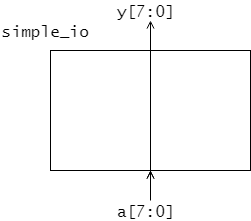
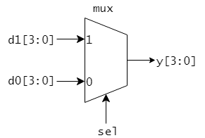
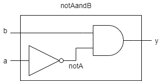

# 2章 SystemVerilog 101

本章では、SystemVerilogの文法のうち、本実習での回路設計を行う上で必要最低限の基本部分を説明します。

## 2.1 module および assign文

SystemVerilogではモジュールを一つの単位として回路を記述していきます。
モジュールについての記述は、予約語の module と endmodule に囲まれます。

 <リスト2.1 simple_ioモジュール>

```sv : simple_io.sv
module simple_io(         // (1) モジュール名: simple_io
  input   logic [7:0] a,  // (2) 8-bit logic 型の入力信号
  output  logic [7:0] y   // (3) 8-bit logic 型の出力信号
);
  // 回路記述
  assign y = a;           // (4)
endmodule
```

リスト2.1に簡単な回路モジュール記述を示しました。
図2.1に示すような回路が構成されます。



<図2.1 simple_io モジュール で構成される回路>

### module と入出力信号

回路モジュールを記述するときは、
まずモジュール名と入出力信号のリストを記述します。

```sv
module simple_io(         // (1) モジュール名: simple_io
  input   logic [7:0] a,  // (2) 8-bit logic 型の入力信号
  output  logic [7:0] y   // (3) 8-bit logic 型の出力信号
);
  ...(中略)
endmodule
```

この例では、モジュール名 simple_io で、
モジュールの入力信号として 8-bit logic 型の入力 a 、
出力信号として 8-bit logic 型の出力 b があるような
回路モジュールを記述しています。

logic 型は 1-bit のデジタル信号の値を表す型で、
論理 0, 1と、ハイインピーダンス状態 z および不定値 x の
値を取ることができます。

8-bitの信号 a の各ビットは a[7], a[6], ..., a[0] のように記述できます。y についても同様です。
また、例えばa[7], a[6], a[5], a[4] をまとめて、a[7:4] のように記述することもできます。

### assign 文

simple_io モジュールの内部では、assign 文を用いて
(出力)信号 y に(入力)信号 a を割り当てています。
```sv
  assign y = a; 
```
8-bit の信号線 y に同じく8-bit の信号線 a を各ビットの順序を保って結線しているとイメージするとよいでしょう。
この simple_io モジュールは 8-bit の入力 a をそのまま出力 y に出力する回路となっています。

---

## 2.2 ビット論理演算

<リスト2.2 logic_gates モジュール>

```SystemVerilog : logic_gates.sv
module logic_gates(
  input  logic [1:0] a,
  input  logic [1:0] b,
  output logic [1:0] y1,
  output logic [1:0] y2,
  output logic [1:0] y3,
  output logic [1:0] y4,
  output logic [1:0] y5
);

  assign y1 = a & b;      // (1) bitwise AND
  assign y2 = a | b;      // bitwise OR
  assign y3 = a ^ b;      // bitwise XOR
  assign y4 = ~a;         // bitwise NOT
  assign y5 = ~(a & b);   // bitwise NAND

endmodule
```

リスト2.2に様々なビット論理演算を用いて構成した回路モジュール logic_gate を示しました。
このモジュールは 2 つの 2-bit 信号 a, b を入力信号とし、5つの 2-bit 信号 y1, y2, y3, y4, y5 を出力信号とします。
y1, y2, y3 にはそれぞれ a と b のビットごとのAND, OR, XOR をとったものが出力されます。
y4 には a のビットごとのNOT、y5 には a と b のビットごとのNANDが出力されます。

リスト2.3中の(1)の部分は下記のようにビットごとに割り当てを行っても同じです。

<リスト2.4 ビットごとの割り当て>

```sv :
  // リスト2.3の(1)は下記のように書いてもよい
  assign y1[1] = a[1] & b[1];
  assign y1[0] = a[0] & b[0];
```

### 演習

リスト2.2 の logic_gates モジュールを実習ボード DE0-CV に実装してその動作を確認しましょう。(Top-Level Entity を logic_gatesとします)

logic_gates モジュールの入出力信号は表2.2aのように DE0-CV の入出力デバイスに割り当てましょう。

<表2.2a logic_gates モジュールの入出力のデバイスへの割り当て>

|信号名|割り当てデバイス|入出力|
|------|----------------|------|
|a[1:0]| SW3-SW2          | input |
|b[1:0]| SW1-SW0          | input |
|y1[1:0]| LEDR9-LEDR8       | output |
|y2[1:0]| LEDR7-LEDR6        | output |
|y3[1:0]| LEDR5-LEDR4        | output |
|y4[1:0]| LEDR3-LEDR2        | output |
|y5[1:0]| LEDR1-LEDR0        | output |

なお、pin planner での設定では、
以下のようなピンの割り当てを示した表が必要となります。

<表2.2b logic_gates モジュールのピン割り当て>

|Node Name | Location |
|----------|----------|
| a[0] | PIN_T13 |
| a[1] | PIN_T12 |
| y1[0] | PIN_L2 |
| ...   | ... |

DE0-CVのユーザーマニュアルから、割り当てデバイスと
FPGAのピン番号(Location) との対応を確認して、
この表を作成し、 pin planner で設定しましょう。


---

## 2.3 定数リテラル

定数リテラルはリスト2.3のようにビット幅と基数(2進、8進、10進、16進)を指定して記述します。
定数を用いるときは、原則ビット幅を指定するようにしましょう。

```sv : 
  // 3-bit 幅の定数 5(10進) の表示方法
  3'b101        // 3-bit 2進数表示
  3'o5          // 3-bit 8進数表示
  3'd5          // 3-bit 10進数表示
  3'h5          // 3-bit 16進数表示

  // 8-bit 幅の定数 172(10進) の表示方法
  8'b1010_1100; // 2進数表示
  8'o254        // 8進数表示
  8'd172        // 10進数表示
  8'hAC         // 16進数表示
```

なお、アンダースコア(\_)は無視されますので、
桁が長い数の場合は、適宜挿入するとよいでしょう。


リスト2.3 に定数を利用した回路モジュールを示します。

<リスト2.3 mask_C3 モジュール>

```sv : mask_C3.sv
module mask_C3 (
  input  logic [7:0] a,
  output logic [7:0] y
);
  assign y = a & 8'b1100_0011;
  // assign y = a & 8'hC3 と書いても同じ
endmodule
```

### 演習

リスト2.3a の mask_C3 モジュールを実習ボード DE0-CV に実装してその動作を確認しましょう。

mask_C3 モジュールの入出力信号は表 2.3a のように DE0-CV の入出力デバイスに割り当てましょう。

<表2.3a mask_C3 モジュールの入出力のデバイスへの割り当て>

|信号名|割り当てデバイス|入出力|
|------|----------------|------|
|a[7:0]| SW7-SW0          | input |
|y[7:0]| LEDR7-LEDR0        | output |


## 2.4 条件割り当て文

リスト2.4 の mux モジュールは図 2.4 のようなマルチプレクサを与えます。

<リスト2.7 mux モジュール>

```systemverilog : mux.sv
module mux(
  input   logic       sel,
  input   logic [3:0] d0,
  input   logic [3:0] d1,
  output  logic [3:0] y
);

  assign y = (sel == 1'd1) ? d1 : d0;
endmodule
```



<図2.4 mux で与えられるマルチプレクサ>

mux4 モジュールは1-bitの信号 sel が 1 の時は y に d1 を出力し、そうでない場合は y に d0 を出力します。

リスト2.7では条件割り当て文を利用しています。
```sv : 条件割り当て文の構文
 condition ? value_for_true : value_for_false
```

条件部分 `condition` には相等比較(==, !=)や大小比較(<, <=, >, >=)を使うことができます。
条件が成り立つときに返す値を `value_for_true` に、成り立たない場合に返す値を `value_for_false` に指定します。

### 演習

リスト 2.4 の mux モジュールを実習ボード DE0-CV に実装してその動作を確認しましょう。

mux モジュールの入出力信号は表2.4のように DE0-CV の入出力デバイスに割り当てましょう。

<表2.4 mux モジュールの入出力のデバイスへの割り当て>

|信号名|割り当てデバイス|入出力|
|------|----------------|------|
|sel   | SW9          | input |
|d1[3:0]| SW7-SW4          | input |
|d0[3:0]| SW3-SW0       | input |
|y[3:0] | LEDR3-LEDR0        | output |


## 2.5 ビット連接

リスト2.5にビット連接を使った回路モジュールを示します。

<リスト2.5 bitmix モジュール>

```systemverilog : bitmix.sv
module bitmix(
  input   logic [3:0] a,
  input   logic [3:0] b,
  output  logic [7:0] y
);

  assign y = {a[1:0], b, a[3:2]}; // (1)

endmodule
```

リスト中(1)の右辺にあるように、信号を{}でくくることで複数の信号のビット連接を行うことができます。
下記リスト2.5aのように書いたものと同じ働きとなります。

<リスト2.5a ビットごとの割り当て>

```systemverilog :
  assign y[7] = a[1];
  assign y[6] = a[0];
  assign y[5] = b[3];
  assign y[4] = b[2];
  assign y[3] = b[1];
  assign y[2] = b[0];
  assign y[1] = a[3];
  assign y[0] = a[2];
```

### 演習

リスト2.5 の bitmix モジュールを実習ボード DE0-CV に実装してその動作を確認しましょう。

bitmix モジュールの入出力信号は表2.5 のように DE0-CV の入出力デバイスに割り当てましょう。

<表2.5 bitmix モジュールの入出力のデバイスへの割り当て>

|信号名|割り当てデバイス|入出力|
|------|----------------|------|
|a[3:0]| SW7-SW4          | input |
|b[3:0]| SW3-SW0       | input |
|y[7:0] | LEDR7-LEDR0        | output |


## 2.6 算術演算(加減算)

加算回路や減算回路を構築する際は `+` や `-` 演算子を用いて記述することができます。

<リスト2.6 adder モジュール(4ビット加算器)>

```sv : adder.sv
module adder(
  input   logic [3:0] a,
  input   logic [3:0] b,
  output  logic [3:0] sum,
  output  logic       carry
);

  assign {carry, sum} = a + b; // (1)

endmodule
```

リスト2.6 のadderモジュールは 4-bit の信号 a と b を加算し、その加算結果を 4-bit のsum に出力し、繰り上がりを 1-bit の carry に出力します。

リスト中(1)のように、加算は + 演算子を用いて書くことができます。同様に減算は - 演算子を使って記述できます。

### 演習

リスト2.6 の adder モジュールを実習ボード DE0-CV に実装してその動作を確認しましょう。

adder モジュールの入出力信号は表2.4のように DE0-CV の入出力デバイスに割り当てましょう。

<表2.6 adder モジュールの入出力のデバイスへの割り当て>

|信号名|割り当てデバイス|入出力|
|------|----------------|------|
|a[3:0]| SW7-SW4          | input |
|b[3:0]| SW3-SW0          | input |
|carry | LEDR9          | output |
|sum[3:0]| LEDR3-LEDR0        | output |


---

## 2.7 モジュール内部の信号

図2.7 の notAandBモジュールには入力信号 a, b と出力信号 y がありますが、
加えてモジュール内部に入力 a の not をとった信号を保持する信号線 notA が存在しています。
この様なモジュール内部で必要な信号線は、
リスト2.11の(1)のようにモジュール内で宣言して使用することができます。



<図2.7 モジュール内部に信号線 notA を持つ notAandB モジュール>

<リスト2.7 notAandB モジュール>

```sv: notAandB.sv
module notAandB (
  input logic a,
  input logic b,
  output logic y
);
  // (1) モジュール内部の信号 notA を宣言
  logic notA;

  assign notA = ~a;
  assign y = notA & b;

endmodule
````

### 演習

リスト2.7の notAandB モジュールを実習ボード DE0-CV に実装してその動作を確認しましょう。

notAandB モジュールの入出力信号は表2.7のように DE0-CV の入出力デバイスに割り当てましょう。

<表2.7 notAandB モジュールの入出力のデバイスへの割り当て>

|信号名|割り当てデバイス|入出力|
|------|----------------|------|
|a     | SW1          | input |
|b     | SW0         | input |
|y     | LEDR0          | output |


## 2.8 always文

レジスタなどの順序回路や、エンコーダ・デコーダなどの複雑な組み合わせ回路は always 文(always_ff 文、always_comb 文など)を使って設計できます。
always 文を使った回路設計については、次章以降で説明します。