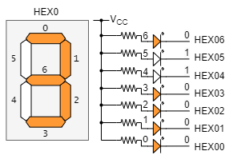

# 3章 組み合わせ論理回路の設計

本章では、always_comb 文を用いて加算器やエンコーダ、マルチプレクサなどの組み合わせ論理回路を設計する方法を学びます。

always_comb 文はいずれかの信号に変化があったときに起動し、always_comp 文の内部の処理が実行されるような回路が構成されます。これによって組合せ回路を設計することができます。

## 3.1 4ビット加算器


[2章](chapter_2.md)のリスト2.6において assign 文を用いて設計した 4 ビット加算回路は、
以下のリスト3.1のように always_comb 文を用いて記述することもできます。

<リスト4.1 adder モジュール(4ビット加算器)>

```sv : adder.sv
module adder(
  input   logic [3:0] a,
  input   logic [3:0] b,
  output  logic [3:0] sum,
  output  logic       carry
);

  always_comb begin
    {carry, sum} = a + b;
  end

endmodule
```

この例では、信号 a もしくは b に変化があったときに always_comb 文が起動し、
a と b の加算結果を sum に出力し、その繰り上がりを carry に出力しています。
すなわち curry 付きの加算回路が実現されます。

always_comb 文の内部で信号の代入を行うには、ブロッキング代入 `=` を用います。
ノンブロッキング代入と呼ばれる `<=` を使うこともできますが、
両者には評価方法についての挙動の違いがあり、
always_comb 文で組み合わせ回路を設計する場合には、
原則としてブロッキング代入 `=` を用いることを推奨します。

なお、always_comb 文や、次章以降で学ぶ always_ff 文などの always 文の内部では assign 文による代入を行うことはできません。
また、always 文の外部ではブロッキング代入やノンブロッキング代入を行うことはできません。


### 演習

リスト3.1の adder モジュールを実習ボード DE0-CV に実装してその動作を確認しましょう。

adder モジュールの入出力信号は表3.1のように DE0-CV の入出力デバイスに割り当ててください。

<表3.1 adder モジュールの入出力のデバイスへの割り当て>

|信号名|割り当てデバイス|入出力|
|------|----------------|------|
|a[3:0]| SW7-SW4          | input |
|b[3:0]| SW3-SW0          | input |
|carry | LEDR9          | output |
|sum[3:0]| LEDR3-LEDR0        | output |


## 3.2 7セグメントデコーダ


DE0-CV には 7 セグメント LED ディスプレイが 6 個 (HEX0~HEX5) 搭載されています。
それぞれのディスプレイは 7 個の LED を用いて数字やアルファベットを表示することができます。




7セグメント LED ディスプレイの各 LED は、対応する入力端子に 0 を入力すると点灯し、
1 を入力すると消灯します。
例えば HEX0 の場合、HEX06~HEX00 に `0110000` を入力すると 番号 6, 3, 2, 1, 0 のLEDが点灯し "3" のパターンを表示できます。


では、DE0-CV に搭載されている 7 セグメント LED ディスプレイを用いて、
4-bit の入力信号を16進数のパターン (0,1,2,3,4,5,6,7,8,9,A,b,c,d,E,F) に変換して表示する回路を設計します。

この回路は、4-bit の入力信号 num[3:0] と 7-bit の出力信号 hex[6:0] の関係が、
表3.2の真理値表で与えられる組み合わせ論理回路
sseg_decoder (図3.2)によって実現できます。

<表3.2 sseg_decoderモジュールの真理値表>

|入力 num[3:0]| 出力 hex[6:0]|
|--------|------|
|0000|1000000|
|0001|1111001|
|0010|0100100|
|0011|0110000|
|0100|0011001|
|0101|0010010|
|0110|0000010|
|0111|1011000|
|1000|0000000|
|1001|0010000|
|1010|0001000|
|1011|0000011|
|1100|0100111|
|1101|0100001|
|1110|0000110|
|1111|0001110|


<図3.2 7セグメントデコーダ sseg_decoder>


このような回路の機能が真理値表で与えられる場合は、case 文を用いて設計することができます。case 文は、入力信号の値に応じて出力信号の値を決定するための文です。
case 文は always 文の中で使用します。

リスト3.2に sseg_decoder モジュールの記述例を示します。

<リスト3.2 sseg_decoder モジュール(7セグメントデコーダ)>

```sv : sseg_decoder.sv
module sseg_decoder(
  input   logic [3:0]   num,
  output  logic [6:0]   hex
);

  always_comb begin
    case (num)
      4'h0  : hex = 7'b100_0000;
      4'h1  : hex = 7'b111_1001;
      4'h2  : hex = 7'b010_0100;
      4'h3  : hex = 7'b011_0000;
      4'h4  : hex = 7'b001_1001;
      4'h5  : hex = 7'b001_0010;
      4'h6  : hex = 7'b000_0010;
      4'h7  : hex = 7'b101_1000;
      4'h8  : hex = 7'b000_0000;
      4'h9  : hex = 7'b001_0000;
      4'ha  : hex = 7'b000_1000;
      4'hb  : hex = 7'b000_0011;
      4'hc  : hex = 7'b100_0110;
      4'hd  : hex = 7'b010_0001;
      4'he  : hex = 7'b000_0110;
      4'hf  : hex = 7'b000_1110;
      default  : hex = 7'b111_1111; // 上記で全パターン尽くされているのでこのdefaultは実際は不要
    endcase
  end

endmodule
```

真理値表がほぼそのまま case 文の中に示されていますので、
case 文の働きはおおよそ見てわかるかと思います。
例えば、num = 4'b1010 (= 4'hA)の時は、y に 7'b0001000を出力します。

case 文を用いて組み合わせ論理回路を設計する場合は、すべての入力パターンを尽くすように記述しなければいけません。
必要に応じて default 文などを用い、すべての入力パターンが尽くされるようにしましょう。

### 演習

リスト 3.2 の sseg_decoder モジュールを実習ボード DE0-CV に実装してその動作を確認しましょう。

sseg_decoder モジュールの入出力信号は表 3.2 のように DE0-CV の入出力デバイスに割り当ててください。

<表 3.2 sseg_decoder モジュールの入出力のデバイスへの割り当て>

|信号名|割り当てデバイス|入出力|
|------|----------------|------|
|num[3:0]| SW3-SW0      | input |
|hex[6:0]| HEX06-HEX00    | output |


## 3.3 マルチプレクサ

図3.3に示す4入力マルチプレクサを設計することを考えます。
表3.3にこの4入力マルチプレクサ mux4 の機能表を示します。


<図3.3 4入力マルチプレクサ mux4>

<表3.3 mux4 モジュールの機能表>

|選択信号 sel[1:0]| 出力 y |
|-----------------|------------|
|00| d0 |
|01| d1 |
|10| d2 |
|11| d3 |

この mux4 モジュールは先ほどとどうお湯に case 文を用いて記述することができます。
リスト 3.3 に mux4 モジュールの記述例を示します。

<リスト 3.3 mux4 モジュール>

```sv : mux4.sv
module mux4 (
  input   logic [1:0] sel, // 選択信号
  input   logic [1:0] d0,
  input   logic [1:0] d1,
  input   logic [1:0] d2,
  input   logic [1:0] d3,
  output  logic [1:0] y
);

  always_comb begin
    case (sel)
      2'b00   : y = d0;
      2'b01   : y = d1;
      2'b10   : y = d2;
      2'b11   : y = d3;
      default : y = 2'b00; // 上記で全パターン尽くされているのでこのdefaultは実際は不要
    endcase
  end

endmodule
```

### 演習

リスト3.3の mux4 モジュールを実習ボード DE0-CV に実装してその動作を確認しましょう。

mux4 モジュールの入出力信号は表3.3aのように DE0-CV の入出力デバイスに割り当てましょう。

<表3.3a mux4 モジュールの入出力のデバイスへの割り当て>

|信号名|割り当てデバイス|入出力|
|------|----------------|------|
|sel[1:0]| SW9-SW8      | input |
|d0[1:0] | SW7-SW6      | input |
|d1[1:0] | SW5-SW4      | input |
|d2[1:0] | SW3-SW2      | input |
|d3[1:0] | SW1-SW0      | input |
|y[1:0]| LEDR1-LEDR0    | output |


## 3.4 プライオリティエンコーダ

図3.4に示すような 4 入力のプライオリティエンコーダを設計することを考えます。
表3.4にこの 4 入力のプライオリティエンコーダ priority_encoder の機能表を示します。

```sv : priority_encoder.sv
module priority_encoder(
  input   logic [3:0] d,  // 入力信号
  output  logic [1:0] y,  // 出力信号
  output  logic       en  // 有効信号
);

  assign en = |d; // d[3] | d[2] | d[1] | d[0] と同じ
  
  always_comb begin
    casez (d)
      4'b1??? : y = 2'b11;
      4'b01?? : y = 2'b10;
      4'b001? : y = 2'b01;
      4'b0001 : y = 2'b00;
      default : y = 2'b00;
     endcase
  end
  
endmodule
```