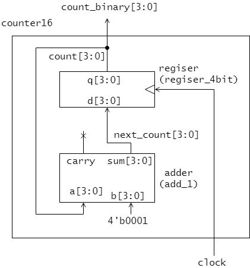
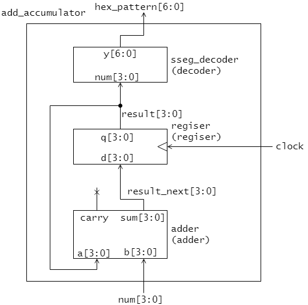

# 4章 モジュールを組み合わせた回路設計

System Verilog ではモジュールを組み合わせ、より大規模な回路モジュールを構築することができます。
本章では、これまでに設計した様々な回路モジュールを組み合わせて新しい回路を設計する方法を学びます。

## 4.1 7 セグメント表示付きプライオリティエンコーダ

3 章ではプライオリティエンコーダ (priori_encoder) や 7 セグメントデコーダ (sseg_decoder) を作成しました。
ここでは、プライオリティエンコーダの出力結果をさらに 7 セグメントデコーダを用いて変換し 7 セグメント LED 上で結果を表示する回路を設計します。


<図4.1 7セグメント表示付きプライオリティエンコーダ>

```sv : shell.sv
module shell(
  input   logic [3:0] SW,
  output  logic [6:0] HEX0,
  output  logic [6:0] HEX1,
  output  logic       LEDR0
);

  logic [1:0] encoded;
  
  priority_encoder p_enc(
    .d  (SW),
    .y  (encoded),
    .en (LEDR0)
  );
  
  sseg_decoder dec1(
    .num  ({2'd00, encoded}),
    .hex  (HEX1)
  );
  
  sseg_decoder dec0(
    .num  (SW),
    .hex  (HEX0)
  );

endmodule
```


```sv : priority_encoder.sv
module priority_encoder(
  input   logic [3:0] d,  
  output  logic [1:0] y,  
  output  logic       en  
);
!!! 
!!!   assign en = |d; // d[3] | d[2] | d[1] | d[0] と同じ
!!! 
!!!   always_comb begin
#     casez (d)
#       4'b1??? : y = 2'b11;
#       4'b01?? : y = 2'b10;
#       4'b001? : y = 2'b01;
#       4'b0001 : y = 2'b00;
#       default : y = 2'b00;
#      endcase
#  end
#   
endmodule
```


図5.1の回路モジュール sseg_adder はその内部で、adder モジュールと sseg_decoder モジュールを利用しています。
adder モジュールの入力 a と b には、sseg_adder の入力 num_a と num_b がそれぞれ接続されています。
同様に、adder モジュールの出力 carry と sseg_decoder モジュールの出力 y は、sseg_adder モジュールの出力 carry と hex_pattern にそれぞれ接続されています。
adder モジュールの出力 sum と sseg_decoder モジュールの入力 num は、sseg_adder の内部信号 sum によって接続されています。
このような、 sseg_adder モジュールはリスト5.1のように記述できます。

<リスト5.1 sseg_adder モジュール(7セグメント表示付き加算器)>

```SystemVerilog : sseg_adder.sv
module sseg_adder (
  input   logic [3:0] num_a,
  input   logic [3:0] num_b,
  output  logic [6:0] hex_pattern,
  output  logic       carry
);
  logic [3:0] sum; // (1) sseg_adderモジュールの内部信号

  adder adder_unit ( // (2) adder モジュールの呼び出し(インスタンス化)
    .a      (num_a), // (3) adder モジュールの入力 a に sseg_adder の入力 num_a を接続
    .b      (num_b),
    .sum    (sum),
    .carry  (carry)
  );

  sseg_decoder decoder_unit (
    .num  (sum),
    .y    (hex_pattern)
  );  

endmodule
```

リスト中(1)では sseg_adder モジュールの内部信号 sum を定義しています。
sseg_adderから見て下位モジュールとなる、adder モジュールの呼び出しは、(2)において行われます。
下位モジュールの呼び出しはインスタンス化とも呼ばれます。
モジュールは回路の設計図を与えるもので、インスタンスはその設計図を実現する回路を実際に配備したものだとイメージするとよいでしょう。
モジュールのインスタンス化は、モジュール名 <module_name> とインスタンス名 <instance_name> およびポートリスト <port_list> (後程説明)を指定して下記のように記述します。
```
<module_name> <instance_name>(<port_list>);
```
リスト中(2)においては、adder モジュールのインスタンス名 adder_unit のインスタンス
を生成しています。

ポートリスト <port_list> では、下位モジュールの入出力信号と上位モジュール(ここではsseg_adder)の信号との接続を記述します。
例えばリスト中(3)では下位モジュール adder モジュールの入力信号 a に、上位モジュールである sseg_adder モジュールの信号 num_a を接続することを示しています。

### 演習

リスト5.1 sseg_adder モジュールを実習ボード DE0-CV に実装してその動作を確認しましょう。
sseg_adder モジュールの入出力信号は表5.1のように DE0-CV の入出力デバイスに割り当ててください。

なお、リスト4.1 adder モジュールとリスト4.2 sseg_decoder モジュールも必要となりますので、プロジェクトにそれらのデザインファイルも追加しましょう。

<表5.1 sseg_adder モジュールの入出力のデバイスへの割り当て>

|信号名|割り当てデバイス|入出力|
|------|----------------|------|
|num_a[3:0]       | SW7-SW4     | input |
|num_b[3:0]       | SW3-SW0     | input |
|hex_pattern[6:0] | HEX06-HEX00 | output |
|carry            | LEDR0       | output |


## 16進カウンタ

リスト3.1の4ビットレジスタ register モジュールと、リスト4.1の4ビット加算器 adder モジュールとを図5.2のように組み合わせることで、クロックの立ち上がりをカウントする16進カウンタを作ることができます。



<図5.2 16進カウンタ counter16 >

この16進カウンタ回路 counter16 モジュールの設計例をリスト5.2に示します。

<リスト5.2 counter16 モジュール (16進カウンタ)>

```SystemVerilog : counter16
module counter16 (
  input   logic       clock,
  output  logic [3:0] count_binary
);
  logic [3:0] count;
  logic [3:0] next_count;

  assign count_binary = count;

  adder add_1 (
    .a      (count),
    .b      (4'b0001),
    .sum    (next_count)
  );

  register register_4bit(
    .clock  (clock),
    .d      (next_count),
    .q      (count)
  );

endmodule
```

### 演習

リスト5.2 counter16 モジュールを実習ボード DE0-CV に実装してその動作を確認しましょう。
counter16 モジュールの入出力信号は表5.2のように DE0-CV の入出力デバイスに割り当ててください。

なお、リスト4.1 adder モジュールとリスト3.1 register モジュールも必要となりますので、プロジェクトにそれらのデザインファイルも追加しましょう。

<表5.2 counter16 モジュールの入出力のデバイスへの割り当て>

|信号名|割り当てデバイス|入出力|
|------|----------------|------|
|clock            | KEY0        | input |
|count_binary[3:0] | LEDR3-LEDR0 | output |


## 7セグメント表示付き加算累積器

リスト3.1の4ビットレジスタ register モジュールと、リスト4.1の4ビット加算器 adder モジュール、リスト4.2の7セグメントデコーダ sseg_decoder モジュールの3つのモジュールを図5.3のように組み合わることで、7セグメント表示付き加算累積器を作ることができます。



<図5.3 7セグメント表示付き加算累積器>

この7セグメント表示付き加算累積器 add_accumulator モジュールはリスト5.3のように記述できます。

<リスト5.3 add_accumulator (7セグメント表示付き加算累積器)>

```SystemVerilog : add_accumulator.sv
module add_accumulator (
  input   logic       clock,
  input   logic [3:0] num,  
  output  logic [6:0] hex_pattern
);
  logic [3:0] next_result;
  logic [3:0] result;

  adder adder (
    .a      (result),
    .b      (num),
    .sum    (next_result)
  );

  register register (
    .clock  (clock),
    .d      (next_result),
    .q      (result)
  );

  sseg_decoder decoder (
    .num    (result),
    .y      (hex_pattern)
  );

endmodule
```

複数のモジュールを組み合わせ回路を設計するときは、まず、図5.3のようなブロック図を描き、上位および下位の各モジュールの入出力信号(インターフェース)とその間の接続を整理しましょう。
そのうえでリスト5.3のような HDL 記述に直すと、間違いが少なくなります。

### 演習

リスト5.3 add_accumulator モジュールを実習ボード DE0-CV に実装してその動作を確認しましょう。
add_accumulator モジュールの入出力信号は表5.3のように DE0-CV の入出力デバイスに割り当ててください。

なお、リスト4.1 adder モジュールとリスト3.1 register モジュール、およびリスト4.2の7セグメントデコーダ sseg_decoder も必要となりますので、プロジェクトにそれらのデザインファイルも追加しましょう。

<表5.3 add_accumulator モジュールの入出力のデバイスへの割り当て>

|信号名|割り当てデバイス|入出力|
|------|----------------|------|
|clock            | KEY0        | input |
|num[3:0]         | SW3-SW0     | input |
|hex_pattern[6:0] | HEX06-HEX00 | output |