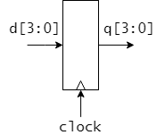
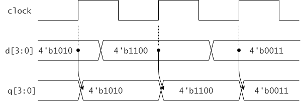
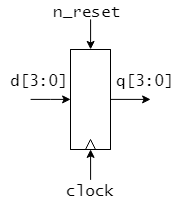
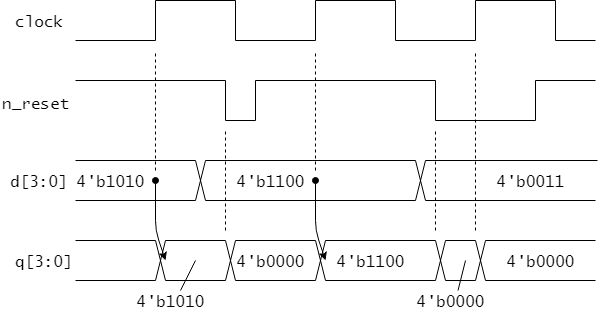

# 5章 レジスタの設計

本章では、always_ff 文を用いてレジスタを設計する方法を学びます。
レジスターはフリップフロップを用いて構成される回路で、
クロック信号の立ち上がりや立下りのタイミングで入力信号の値を取り込み、その値を保持する回路です。
レジスタはデータを一時的に保存するためのメモリ素子であり、
特に順序回路の設計において重要な構成要素です。

## 5.1 4ビットレジスタ

```sv : register4.sv
module register4(
  input   logic         clock,
  input   logic   [3:0] d,
  output  logic   [3:0] q
);

  always_ff @ (posedge clock) begin
    q <= d;
  end
endmodule
```

---

## 5.2 レジスタ (ビット幅のパラメータ化)
リスト 5.1 の register モジュールは、ビット幅をパラメータとして指定できるようにしたレジスタの設計例です。

```sv : register.sv
module register #(parameter WIDTH = 4)(
  input   logic         clock,
  input   logic [WIDTH-1:0] d,
  output  logic [WIDTH-1:0] q
);

  always_ff @ (posedge clock) begin
    q <= d;
  end
endmodule
```

```sv : shell.sv
module shell(
  input   logic       KEY0,
  input   logic [7:0] SW,
  output  logic [7:0] LEDR
);

  register #(.WIDTH(8)) reg8(
    .clock  (KEY0),
    .d      (SW),
    .q      (LEDR)
  ); 
  
endmodule

```

---
## 5.3 同期リセット付きレジスタ


リスト 5.2 の register_ar モジュールは、同期リセット機能を持つレジスタの設計例です。

```sv : register_r.sv
module register_ar #(
  parameter WIDTH = 4,
  parameter logic [WIDTH-1:0] RESET_VALUE = '0 // リセット値
)
(
  input   logic         clock,
  input   logic         reset_n, // active low
  input   logic [WIDTH-1:0] d,
  output  logic [WIDTH-1:0] q
);

  always_ff @ (posedge clock) begin
    if (reset_n == 1'b0) begin
      q \<= RESET_VALUE;   // reset
    end else begin
      q <= d;
    end
  end

---

図3.1に示したクロック同期の4ビットレジスタを設計します。
この回路はリスト3.1の register モジュールのように記述できます。



<図3.1 4ビットレジスタ>


<リスト3.1 register モジュール (4ビットレジスタ)>

```SystemVerilog : register.sv
module register(
  input   logic         clock,
  input   logic   [3:0] d,
  output  logic   [3:0] q
);

  always_ff @ (posedge clock) begin // (1) clockの立ち上がりのタイミングで起動
    q <= d; // (2) qにdの値を代入する(ノンブロッキング代入)
  end

endmodule
```

レジスタのようにフリップフロップによって構成されるような回路は always_ff 文を使って設計することができます。
always_ff 文は @ 以下に示された信号が変化したときに、begin と end で囲われた部分が実行されるような回路を構成します。
リスト3.1の(1)の部分では、clock 信号の立ち上がり(posedge)のタイミングが指定してあります。
すなわち、clock 信号の立ち上がりのタイミングで(2)の`q <= d`が実行されます。
これは信号 q に信号 d の値を代入することを示しています。

この register モジュールの動作をまとめると、clock 信号の立ち上がりのタイミングで入力信号 d の値を取り込み、その値を q に保持し出力することになります。
図3.2にこのregister モジュールの動作例をタイムチャートで示します。
上記の動作を確認してください。



<図3.2 register モジュールの動作例>

今回、リスト4.1の always_ff 文で用いた `q <= d` のような `<=` による代入はノンブロッキング代入と呼ばれます。
フリップフロップによって構成されるような回路を設計するときは原則としてノンブロッキング代入を用いるのが良い習慣です。

### 演習

リスト3.1 register モジュールを実習ボード DE0-CV に実装してその動作を確認しましょう。

register モジュールの入出力信号は表3.1のように DE0-CV の入出力デバイスに割り当てましょう。

<表3.1 register モジュールの入出力のデバイスへの割り当て>

|信号名|割り当てデバイス|入出力|
|------|----------------|------|
|clock | KEY0           | input |
|d[3:0]| SW3-SW0          | input |
|q[3:0]| LEDR3-LEDR0       | output |

## 非同期リセット付きレジスタ

先ほど設計したクロック同期の4ビットレジスタに、非同期リセット機能を追加した回路の設計を考えます。
図3.3のようにリセット入力信号 n_reset を追加します。
n_reset はアクティブローとします。
つまり、通常時は n_reset には 1 が入力され、n_reset が0になったときにリセット機能が働くものとします。

この非同期リセット付き4ビットレジスタは、リスト3.2の register_ar モジュールのように記述できます。




<図3.3 非同期リセット付き4ビットレジスタ>

<リスト3.2 register_ar モジュール(非同期リセット付き4ビットレジスタ)>

```SystemVerilog : register_ar.sv
module register_ar( // asynchronous reset
  input   logic       clock,
  input   logic       n_reset, // active low (0になったらリセット)
  input   logic [3:0] d,
  output  logic [3:0] q
);

  always_ff @ (posedge clock, negedge n_reset) begin
    if (n_reset == 1'b0) begin
      q <= 4'b0000;   // reset
    end else begin
      q <= d;
    end
  end

endmodule
```

今回の always_ff 文では起動されるタイミングとして、 clock の立ち上がりと n_reset の立下り(negedge)の両方が指定されています。
また always_ff 文中では if 文が用いられており、n_reset が0の時は q をリセット(0を代入)し、そうでない場合は d の値を q に代入することを記述しています。

このように条件により異なる動作をする回路を記述したい場合、 always_ff 文や4章で示す always_comb 文などの always 文中において、 if 文を使うことができます。
なお、always 文の外側では if 文を使うことはできません。

図3.4に register_ar モジュールの動作例をタイムチャートで示します。
n_reset の立下りのタイミングで q がリセットされていることを確認しましょう。
また、clock の立ち上がりのタイミングでも、 n_reset が0となっていれば同様にリセットが起こることに注意しましょう。



<図3.4 register_ar モジュールの動作例>

### 演習

リスト3.2 register_ar モジュールを実習ボード DE0-CV に実装してその動作を確認しましょう。

register_ar モジュールの入出力信号は表3.2のように DE0-CV の入出力デバイスに割り当てましょう。

<表3.2 register_ar モジュールの入出力のデバイスへの割り当て>

|信号名|割り当てデバイス|入出力|
|------|----------------|------|
|clock | KEY0           | input |
|n_reset| KEY1          | input |
|d[3:0]| SW3-SW0          | input |
|q[3:0]| LEDR3-LEDR0       | output |

